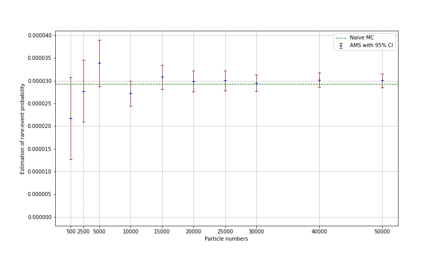
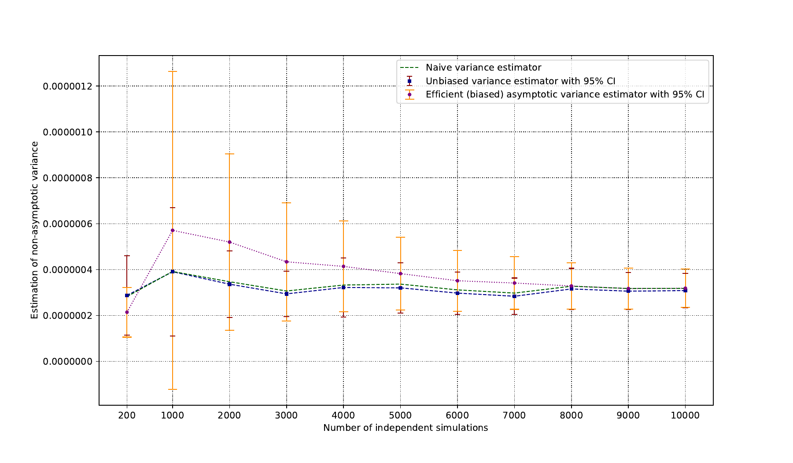
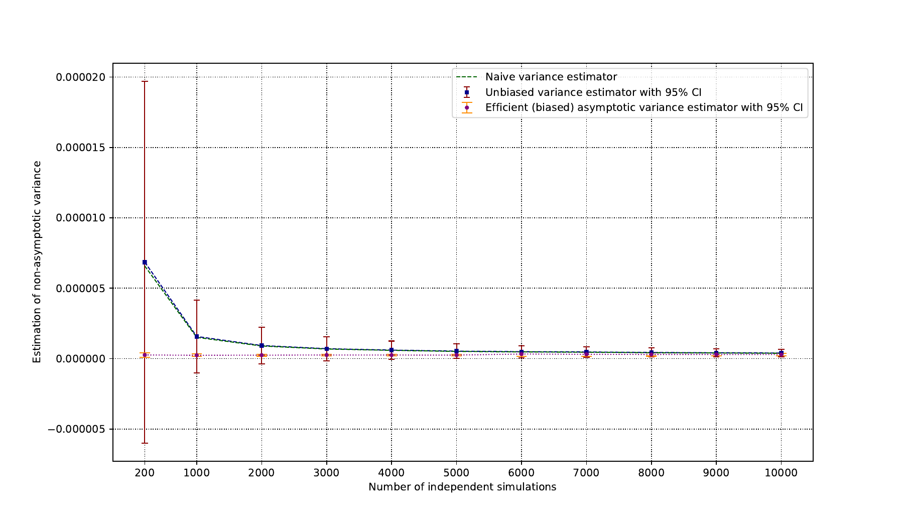

# aAMS

Asymmetric SMC version of Adaptive Multilevel Splitting with efficient variance estimator implemented in `Cython`.



## Illustration of the performance of difference variance estimators

* N = 200 (the size of iteracting particle system)


* N = 500 (the size of iteracting particle system)



## Installation

Clone the git repository:
```
git clone https://github.com/MGIMM/aAMS.git
```
Install with `pip`:

```
cd aAMS
```
and
```
pip install .
```

## Usage


```python
from aAMS import aAMS, naive_MC
from time import time
from tqdm import tqdm
import numpy as np


# Naive Monte Carlo

N_test = 100000
list_mc = []
for i in tqdm(range(1000)):
    list_mc += [naive_MC(N = np.intc(N_test),
                         x_init = -0.75,
                         y_init = 0.0,
                         beta = 4.1,
                         dt = 0.01)]
print("estimation of rare event:", np.mean(list_mc))
print("naive asymptotic variance estimator:", N_test*np.var(list_mc))

### output:
# 100%|██████████| 1000/1000 [01:00<00:00, 16.43it/s]
# 
# estimation of rare event: 2.9700000000000004e-05
# naive asymptotic variance estimator: 3.0891e-05


# Adaptive Multilevel Splitting

t0=time()
m,v = aAMS(x_init = -0.75,
           y_init = 0.0,
           beta = 4.1,
           dt = 0.01,
           level_star = 1.75,
           N = 10000,       
           K = 1,
           iota=0.1,
           n_max = 100000
           ) 

"""
gAMS implementation based on Asymmetric SMC with efficient asymptotic variance estimation.

Attributes
----------
    x_init: double
        x-coordinate of the initial point.
    y_init: double
        y-coordinate of the initial point.
    beta: double
        Inverse temperature of the associated overdamped Langevin dynamic.
    dt: double
        Time step of the discretization.
    K: (C: np.intc) (py:int)
        Minimum Number of particles to be killed at each iteration.
        Theoretical guarantee is availble when K = 1. In fact, this is the only case where the efficient 
        variance estimator is availble.
    N: (C: long) (py: int)
        Number of particles at each iteration.
    n_max: (C: long) (py: int)
        Upper bound of the number of levels. This is introduced to control the memory allocation. There is no loss of memory 
        efficiency when iota is not set to be 0, since an adaptive procedure of memory allocation will be conducted in order to
        match the number of levels introduced by iota.
    iota: double
        Artificial step size of reaction coordinate. When iota is non-zero, the gAMS enters into Asymmetric SMC framework.
        The asymptotic variance is therefore available as a by-product of the simulation of IPS.
    var_estimation: "asymptotic" or "non-asymptotic"
        Whether the efficient (biased) asymptotic variance estimator or the
        non-asymptotic (unbiased but not efficient) variance estimator
        should be implemented. The time complexity are respectively O(TN) and O(TN^2).
    
Return 
------
double: the estimation of probability.
double: the estimation of asympotic variance.

Remarks
-------
Notice that the asymptotic variance estimator is biased!  The (stochastic)
bias is of order O_p(1/N). Hence, when N is small, one may encounter the
case where the estimation of the asymptotic variance is completely
irrelevant! This indicates that the number of particles N is too low for
the current problem. In this case, one should use non-asymptotic variance
estimator.  However, when N is larger (typically larger than 500), it is
expected that the difference between non-asymptotic variance estimator
(multiplied by N) and asymptotic variance estimator is very small.
Therefore, we recomment to use the asymptotic variance estimator, which is
more efficient by design.  When iota is set to be small, it is also
possible to encounter some "bias" in the varianc estimation. The essential
problem is that the consistency of thte variance estimator is guaranteed in
the sense that the number of levels is finite, i.e. not too big w.r.t. the
number of particles N. Hence, it is encouraged to use relatively larger
iota in order to ensure that the number of levels is not too big (or even
bigger than N). This costs a slightly larger asymptotic variance.  However,
there will be no problem for non-asymptotic variance estimator, even for
the choice iota = 0. In fact, the unbiasedness is trivial by replacing the
martigale structure by local martigale structure (cf. du 2019, aSMC). 
"""
print("mean:",m,"\nvar:",v)
print(time()-t0,"seconds used.")

### output:
# mean: 2.9496228881400097e-05 
# var: 3.937245849267889e-08
# 0.8391783237457275 seconds used.


# Comparison with naive variance estimator

N_test = 5000
K_test = 1
n_sim = 500
list_gams = np.zeros(n_sim) 
list_var = np.zeros(n_sim) 
for i in tqdm(range(n_sim)):
    list_gams[i],list_var[i] = aAMS(x_init = -0.75,
                                    y_init = 0.0,
                                    beta = 4.1,
                                    dt = 0.01,
                                    level_star = 1.75,
                                    N = N_test,       
                                    K = K_test,
                                    iota=0.1,
                                    n_max = 100000
                                    )

print("estimation of rare event:", np.mean(list_gams))
print("naive asymptotic variance estimator:", N_test*np.var(list_gams))
print("mean asymptotic variance estimator:", np.mean(list_var))
print("VoV:", np.var(list_var))
print("ideal variance for gAMS:",-np.log(np.mean(list_gams))*np.mean(list_gams)**2)

### output:
# 100%|██████████| 500/500 [03:23<00:00,  2.45it/s]
# estimation of rare event: 2.9022656130470198e-05
# naive asymptotic variance estimator: 3.9672002621255104e-08
# mean asymptotic variance estimator: 3.8650810422399494e-08
# VoV: 7.747465305795918e-17
# ideal variance for gAMS: 8.800025686164234e-09


```

## Plot

```python
from aAMS import aAMS, naive_MC
import matplotlib.pyplot as plt   
import numpy as np
from tqdm import tqdm

# calculate reference value by naive MC
N_test = 1000
list_mc = []
for i in tqdm(range(50000)):
    list_mc += [naive_MC(N = np.intc(N_test),
                         x_init = -0.75,
                         y_init = 0.0,
                         beta = 4.1,
                         dt = 0.05)]
nmc = np.mean(list_mc)

# viz
_N_list = [500,2500, 5000, 10000,15000, 20000, 25000, 30000, 40000, 50000]
m = np.zeros(len(_N_list))
d = np.zeros(len(_N_list))
for i in tqdm(range(len(_N_list))):
    m[i],d[i] = aAMS(x_init = -0.75,
                     y_init = 0.0,
                     beta = 4.1,
                     dt = 0.05,
                     level_star = 1.75,
                     N = _N_list[i],       
                     K = 1,
                     iota=0.05,
                     n_max = 1000000
                     ) 

plt.figure(figsize = (12,7))
#plt.errorbar(_N_list, m, yerr=np.sqrt(d/_N_list), color = "black")
plt.errorbar(_N_list, m, yerr=1.96*np.sqrt(d/_N_list),fmt='+',ecolor='darkred',color='darkblue',elinewidth=1,capsize=3, label="AMS with 95% CI")
plt.axhline(y=nmc, color='darkgreen',lw = 1, linestyle='dashed', label='Naive MC')
#plt.grid(linestyle = 'dotted', color = "grey")
for i in range(len(_N_list)):
    plt.axvline(_N_list[i], linestyle='dotted', color='grey',lw=1) 
    #plt.axhline( m[i]+1.96*np.sqrt(d/_N_list)[i], linestyle='dotted', color='grey',lw=1) 
    #plt.axhline( m[i]-1.96*np.sqrt(d/_N_list)[i], linestyle='dotted', color='grey',lw=1) 
for i in range(5):
    plt.axhline( i*10e-6, linestyle='dotted', color='grey',lw=1) 
plt.ylabel("Estimation of rare-event probability")
plt.xlabel("Particle numbers")
plt.xticks(_N_list)
plt.legend()
plt.show()
#plt.savefig("./ams.png")
```
## Remarks

* The purpose of this package is to provide a well optimized implementation of
  gAMS algorithm based on Asymmetric SMC framework that **can run on a personal laptop**, which mainly contributes to the numerical part of my PHD thesis. 

* Since the computation of
  the variance estimator is highly non-trivial, a readable code can be found in `./aAMS/aAMS.pyx`.

* Currently, the code is based on the overdamped Langevin dynamic with a
  three-hole potential. The generalization to the general Markov dynamic in a
  high-dimensional setting is straightforward. The computational costs are linear
  w.r.t. the underlying dimension of the Markov process. Contact me if you have
  any question.


## Reference

Generalized Adaptive Multilevel Splitting. \[[pdf](https://arxiv.org/pdf/1505.02674.pdf)\]

Asymmetric Sequential Monte Carlo. \[[pdf](https://mgimm.github.io/doc/du19.pdf)\]


